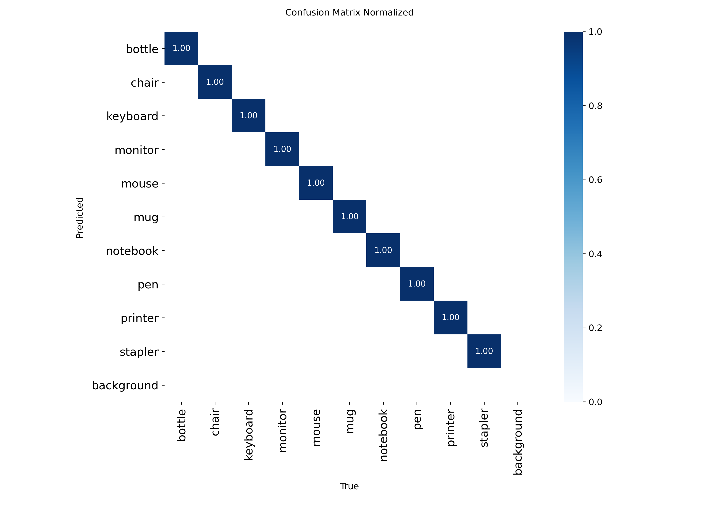
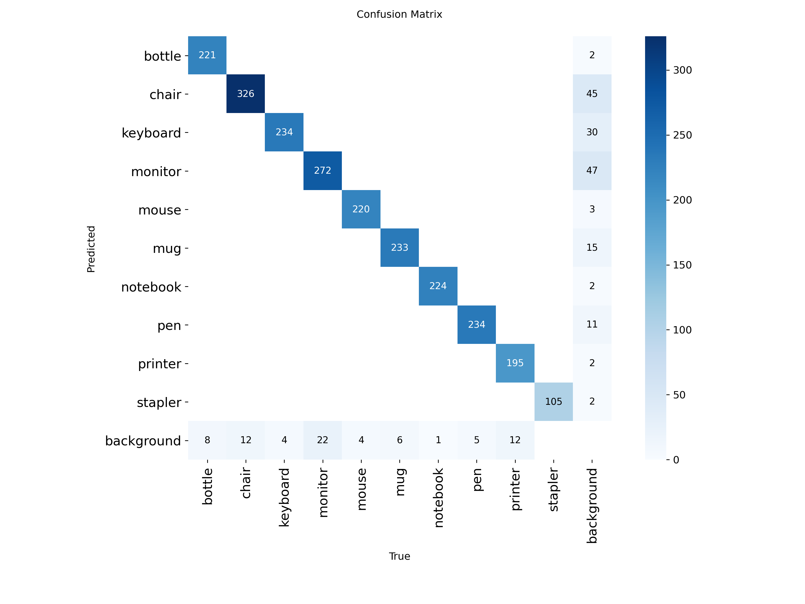
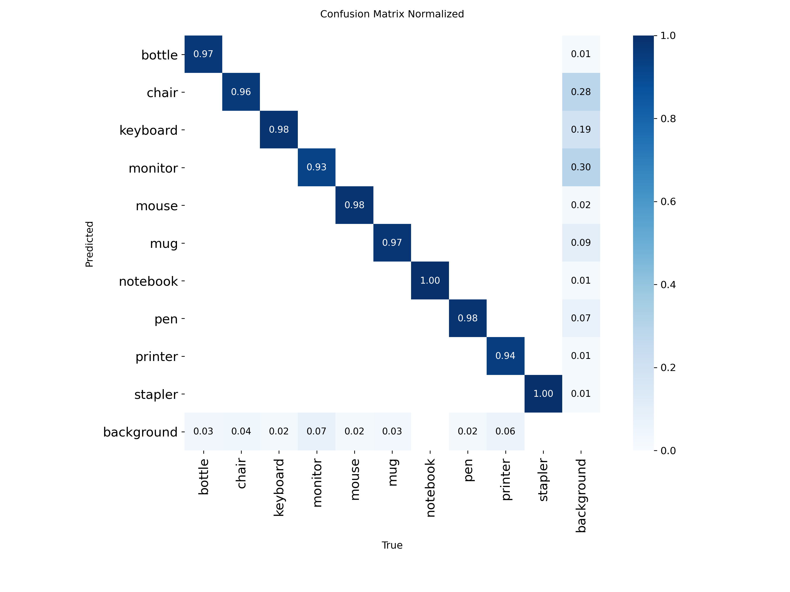

# Office Item Classifier

[](https://www.python.org/downloads/)
[](https://github.com/ultralytics/ultralytics)
[](LICENSE)

**AI-powered office item recognition system using YOLOv8 for real-time classification and detection.**

---

## 📋 Table of Contents

- [Quick Links](#-quick-links)
- [Overview](#-overview)
- [Features](#-features)
- [Performance Metrics](#-performance-metrics)
- [Prerequisites](#-prerequisites)
- [Installation](#-installation)
- [Quick Start](#-quick-start)
- [Usage Examples](#-usage-examples)
- [Project Structure](#-project-structure)
- [Model Performance](#-model-performance)
- [Dataset](#-dataset)
- [Documentation](#-documentation)
- [Troubleshooting](#-troubleshooting)
- [Training (Optional)](#-training-optional)
- [Author](#-author)

---

## 🔗 Quick Links

| Resource | Link |
|----------|------|
| 📊 **Dataset** | [OneDrive - Training/Validation/Test Images](https://livemdxac-my.sharepoint.com/:f:/g/personal/os439_live_mdx_ac_uk/EpnYRvlNasNNgDrTMkt8GoMBeEvE0WEpRU91_VP6k5VISg) |
| 📄 **Final Report** | [PDF Report](docs/Report/FinalSubmission/PDE3802Assessment1Report.pdf) |
| 🎥 **Video Walkthrough** | [2-Minute Code Demo](#) *(Coming Soon)* |
| 💻 **Source Code Details** | [SOURCE_CODE.md](src/SOURCE_CODE.md) |

---

## 🎯 Overview

This project implements a comprehensive **office item recognition system** capable of:
- **Classification**: Identifying single items from images or live camera feed
- **Detection**: Locating and classifying multiple items in cluttered scenes

**Supported Classes (10):**
Bottle, Chair, Keyboard, Monitor, Mouse, Mug, Notebook, Pen, Printer, Stapler

**Key Achievement:** 99.949% classification accuracy with only 1 error out of 1,961 validation samples.

---

## ✨ Features

- 🎨 **Modern Tkinter UI** with dark cyberpunk theme
- 📸 **Live Camera Inference** with real-time classification
- 📁 **Batch Processing** for folders and videos
- 🎯 **Dual Model Support** (Classification + Detection)
- 📊 **Confidence Scores** and visual feedback
- ⚡ **GPU Acceleration** (CUDA support)
- 🔄 **Real-time Processing** with optimized inference

---

## 📊 Performance Metrics

### Classification Model (V4 - Deployment)

| Metric | Value | Notes |
|--------|-------|-------|
| **Top-1 Accuracy** | **99.949%** | 1 error in 1,961 samples |
| **Top-5 Accuracy** | **99.949%** | Perfect top-5 performance |
| **Mouse Class** | **99.5%** | Fixed from V3's 90.8% |
| **Other Classes** | **100%** | Perfect on 9/10 classes |
| **Model Size** | 12 MB | YOLOv8n-cls |

**Key Improvement:** V4 achieved 96% error reduction over V3 through dataset doubling (~1,950 → ~3,900 samples).

📈 [Full Classification Analysis](docs/Classification/Classification_V4_Analysis.md)  
📊 [V3 vs V4 Comparison](docs/Classification/Comparative_Analysis_V3_vs_V4.md)

### Detection Model (V5 - Deployment)

| Metric | Value | Notes |
|--------|-------|-------|
| **mAP@0.5** | **98.3%** | Best among all versions |
| **mAP@0.5-0.95** | **96%** | Strong multi-threshold performance |
| **Background FPs** | 75 | Reduced from V4's 87 |
| **Dataset Size** | ~26,000 instances | 2× larger than V1-V3 |

📈 [Full Detection Analysis](docs/Detection/Detection_V5_Analysis.md)  
📊 [Model Comparison V1-V5](docs/Detection/ModelComparison.md)

### Confusion Matrices & Error Analysis

**Classification V4:**
- ✅ 9/10 classes: Perfect 100% accuracy
- ⚠️ Mouse: 99.5% (1 misclassification)
- Error type: Single mouse → stapler confusion

**Detection V5:**
- ✅ Best per-class AP across all versions
- ✅ Lowest background false positives
- ✅ Excellent performance on previously challenging classes (Chair, Monitor)

See [Error Analysis](docs/Classification/Classification_V4_Analysis.md#identified-issues) for detailed breakdown.

---

## 🔧 Prerequisites

### System Requirements

- **Python Version:** 3.12.8 (recommended for full compatibility)
- **RAM:** 8GB minimum (16GB recommended)
- **GPU:** NVIDIA RTX 40/50 series recommended (CPU fallback available)
- **Storage:** ~5GB for models and dependencies

### Check Your Python Version

```bash
python --version
```

**If you don't have Python 3.12.8:**
- Download from [python.org](https://www.python.org/downloads/release/python-3128/)
- **Important:** Using a different Python version may cause compatibility issues

---

## 📦 Installation

### Step 1: Clone the Repository

```bash
git clone https://github.com/Shuaibu-oluwatunmise/office-item-classifier.git
cd office-item-classifier
```

### Step 2: Create Virtual Environment (Recommended)

```bash
# Create virtual environment with Python 3.12.8
# Windows:
py -3.12 -m venv venv

# Linux/Mac:
python3.12 -m venv venv

# Activate virtual environment
# Windows:
venv\Scripts\activate

# Linux/Mac:
source venv/bin/activate
```

### Step 3: Install PyTorch

**⚠️ CRITICAL: Install PyTorch BEFORE requirements.txt**

#### For NVIDIA RTX 40/50 Series (GPU):

```bash
pip install --pre torch torchvision torchaudio --index-url https://download.pytorch.org/whl/nightly/cu128
```

#### For Other NVIDIA GPUs:

Check your CUDA version and install compatible PyTorch from [pytorch.org](https://pytorch.org/get-started/locally/)

#### For CPU Only:

```bash
pip install torch>=2.0.0 torchvision>=0.15.0 torchaudio
```

### Step 4: Verify PyTorch Installation

```bash
python -c "import torch; print(f'PyTorch: {torch.__version__}'); print(f'CUDA Available: {torch.cuda.is_available()}')"
```

**Expected Output:**
```
PyTorch: 2.x.x
CUDA Available: True  # (or False if CPU-only)
```

### Step 5: Install Dependencies

```bash
pip install -r requirements.txt
```

**Key Dependencies:**
- `ultralytics` - YOLO framework
- `opencv-python` - Computer vision
- `Pillow` - Image processing
- `numpy` - Array operations

---

## 🚀 Quick Start

### Launch the UI (Recommended for Testing)

```bash
python src/ui/app_main.py
```

**UI Features:**
- 🎨 Modern dark cyberpunk interface
- 📸 Live camera classification
- 📁 File/folder/video processing
- 🎯 Real-time confidence scores
- 📊 Visual feedback and results

**Expected Output:**
- Tkinter window opens with main menu
- Options for Camera, File, Folder, or Video input
- Real-time classification with confidence percentages

---

## 📖 Usage Examples

### 1. Single Image Classification

```bash
python src/classification/file_inference.py --image my_data/IMG-20251105-WA0007.jpg --model runs/classify/yolov8n_cls_V4/weights/best.pt
```

**Expected Output:**
```
Loading model from: runs/classify/yolov8n_cls_V4/weights/best.pt
Processing: my_data/IMG-20251105-WA0007.jpg
Predicted Class: mouse
Confidence: 99.87%
```

### 2. Batch Folder Classification

```bash
python src/classification/file_inference.py --folder my_data/ --model runs/classify/yolov8n_cls_V4/weights/best.pt
```

**Expected Output:**
```
Processing 8 images from: my_data/
[1/8] IMG-20251105-WA0007.jpg -> mouse (99.87%)
[2/8] IMG-20251105-WA0008.jpg -> keyboard (98.45%)
[3/8] IMG-20251105-WA0009.jpg -> monitor (99.12%)
...
Summary: 8/8 processed successfully
```

### 3. Live Camera Classification

```bash
python src/classification/live_inference.py --model runs/classify/yolov8n_cls_V4/weights/best.pt
```

**Expected Output:**
- Camera window opens
- Real-time classification overlay
- Press 'q' to quit

### 4. Video Processing

```bash
python src/classification/file_inference.py --video my_data/VID-20251105-WA0001.mp4 --model runs/classify/yolov8n_cls_V4/weights/best.pt
```

**Expected Output:**
- Processed video saved to `output/`
- Frame-by-frame classification results

### 5. Object Detection (Multiple Items)

```bash
python src/detection/File_Inference.py --image my_data/IMG-20251105-WA0007.jpg --model runs/detect/yolov8n_detect_V5/weights/best.pt
```

**Expected Output:**
```
Detected 3 objects:
  - mouse (95.2%) at [x1, y1, x2, y2]
  - keyboard (98.7%) at [x1, y1, x2, y2]
  - monitor (96.4%) at [x1, y1, x2, y2]
```

### 6. Live Detection Feed

```bash
python src/detection/Live_Feed.py --model runs/detect/yolov8n_detect_V5/weights/best.pt
```

---

## 📁 Project Structure

```
office-item-classifier/
│
├── src/                          # Source code modules
│   ├── classification/           # Classification scripts
│   │   ├── file_inference.py     # Batch/single file inference
│   │   ├── live_inference.py     # Real-time camera classification
│   │   ├── train.py              # Training script
│   │   └── organise_dataset.py   # Dataset organization
│   │
│   ├── detection/                # Detection scripts
│   │   ├── File_Inference.py     # Multi-object detection
│   │   ├── Live_Feed.py          # Real-time detection
│   │   ├── train.py              # Detection training
│   │   └── dataset_stats.py      # Dataset analysis
│   │
│   ├── data_annotation/          # Annotation tools
│   │   ├── Auto_Annotate.py      # Grounding DINO auto-annotation
│   │   └── visualize_yolo.py     # YOLO label visualization
│   │
│   ├── data_collection/          # Data collection utilities
│   │   ├── data_collection.py    # Camera recording tool
│   │   └── extract_frames.py     # Video frame extraction
│   │
│   ├── ui/                       # Tkinter UI application
│   │   ├── app_main.py           # Main application entry
│   │   ├── components/           # Reusable UI components
│   │   ├── screens/              # UI screens (home, camera, results)
│   │   └── utils/                # UI utilities and handlers
│   │
│   └── SOURCE_CODE.md            # Detailed code documentation
│
├── runs/                         # Training outputs
│   ├── classify/                 # Classification model runs
│   │   ├── yolov8n_cls_V3/       # Version 3 (superseded)
│   │   └── yolov8n_cls_V4/       # Version 4 (Deployment) ✅
│   │       └── weights/
│   │           └── best.pt       # Deployment classification model
│   │
│   └── detect/                   # Detection model runs
│       ├── yolov8n_detect_V1/    # Version 1 (baseline)
│       ├── yolov8n_detect_V2/    # Version 2 (improved)
│       ├── yolov8n_detect_V3/    # Version 3 (overfitted)
│       ├── yolov8n_detect_V4/    # Version 4 (2× dataset)
│       └── yolov8n_detect_V5/    # Version 5 (Deployment) ✅
│           └── weights/
│               └── best.pt       # Deployment detection model
│
├── docs/                         # Documentation
│   ├── Classification/           # Classification model analyses
│   │   ├── Classification_V3_Analysis.md
│   │   ├── Classification_V4_Analysis.md
│   │   └── Comparative_Analysis_V3_vs_V4.md
│   │
│   ├── Detection/                # Detection model analyses
│   │   ├── Detection_V1_Analysis.md
│   │   ├── Detection_V2_Analysis.md
│   │   ├── Detection_V3_Analysis.md
│   │   ├── Detection_V4_Analysis.md
│   │   ├── Detection_V5_Analysis.md
│   │   └── ModelComparison.md
│   │
│   └── Report/                   # Academic reports
│       ├── FinalSubmission/
│       │   └── PDE3802Assessment1Report.pdf  # 📄 FINAL REPORT
│       └── First_Draft/          # Draft and feedback
│
├── legacy/                       # Historical versions
│   ├── LEGACY.md                 # Evolution documentation
│   ├── Version 1/                # ResNet18 prototype
│   └── Version 2/                # Multi-model comparison
│
├── my_data/                      # Test samples
│   ├── IMG-20251105-WA0007.jpg   # Test images (8 total)
│   └── VID-20251105-WA0001.mp4   # Test video
│
├── requirements.txt              # Python dependencies
├── DATASET.md                    # Dataset card
└── README.md                     # This file
```

### Key Folders Explained

**`src/classification/`** - Image classification module
- Single-class prediction per image
- Real-time camera support
- See [SOURCE_CODE.md](src/SOURCE_CODE.md) for implementation details

**`src/detection/`** - Multi-object detection module
- Simultaneous multiple item detection
- Bounding box localization
- See [Detection Analysis](docs/Detection/ModelComparison.md) for performance

**`src/data_annotation/`** - Automated annotation tools
- Grounding DINO integration for auto-labeling
- YOLO format visualization
- Used to create detection dataset

**`src/data_collection/`** - Dataset creation utilities
- Camera-based video recording
- Frame extraction from videos
- See [LEGACY.md](legacy/LEGACY.md) for data evolution story

**`src/ui/`** - Deployment-ready GUI
- Tkinter-based interface
- Dark cyberpunk theme
- Multi-input support (camera/file/folder/video)

**`runs/`** - All trained models with full metrics
- Confusion matrices
- Training curves
- Validation predictions
- Model weights (`.pt` files)

**`docs/`** - Comprehensive documentation
- Model performance analyses
- Training evolution
- Error analysis
- Academic report

**`legacy/`** - Historical development
- Version 1: ResNet18 prototype (96% accuracy, domain gap issue)
- Version 2: 5-model competition (YOLOv8n won)
- See [LEGACY.md](legacy/LEGACY.md) for full evolution story

---

## 🏆 Model Performance

### Classification Evolution

| Version | Accuracy | Mouse Class | Total Errors | Dataset Size | Status |
|---------|----------|-------------|--------------|--------------|--------|
| V3 | ~100% | 90.8% ⚠️ | 18 | ~1,950 | Superseded |
| **V4** | **99.949%** | **99.5%** ✅ | **1** | **~3,900** | **Deployment** ✅ |

**Key Insight:** Doubling the dataset eliminated 96% of errors (18 → 1).

📊 [Full Comparison](docs/Classification/Comparative_Analysis_V3_vs_V4.md)

### Detection Evolution

| Version | mAP@0.5 | Dataset | Background FPs | Status |
|---------|---------|---------|----------------|--------|
| V1 | 98.4% | ~13K | 44 | Baseline |
| V2 | 98.3% | ~13K | 38 | Best of V1-V3 |
| V3 | 98.0% | ~13K | 47 | Overfitted |
| V4 | 98.1% | ~26K | 87 | Good |
| **V5** | **98.3%** | **~26K** | **75** | **Deployment** ✅ |

**Key Insight:** Dataset size matters! V4/V5 (2× data) consistently outperform V1-V3.

📊 [Full Comparison](docs/Detection/ModelComparison.md)

### Confusion Matrices

**Classification V4:**




**Detection V5:**




---

## 📦 Dataset

### Overview

**Total Images:** ~50,000+ images across training/validation/test sets

**Classes (10):** Bottle, Chair, Keyboard, Monitor, Mouse, Mug, Notebook, Pen, Printer, Stapler

**Download:** [OneDrive Dataset Link](https://livemdxac-my.sharepoint.com/:f:/g/personal/os439_live_mdx_ac_uk/EpnYRvlNasNNgDrTMkt8GoMBeEvE0WEpRU91_VP6k5VISg)

### Dataset Structure

```
dataset/
├── classification/
│   ├── train/          # ~3,600 images per class
│   ├── val/            # ~196 images per class
│   └── test/           # ~196 images per class
│
└── detection/
    ├── train/          # ~26,000 instances
    │   ├── images/
    │   └── labels/     # YOLO format annotations
    ├── val/
    └── test/
```

### Dataset Characteristics

**Classification Dataset (V4):**
- Perfectly balanced: 2,500+ images per class
- Diverse backgrounds (office desks, shelves, in-use scenarios)
- Multiple viewing angles
- Various lighting conditions
- Real-world office contexts

**Detection Dataset (V5):**
- ~26,000 labeled instances (2× V1-V3)
- Multiple objects per image
- Cluttered scenes
- YOLO format bounding boxes
- Grounding DINO assisted annotations

### Data Quality Improvements

**V1 → V2 (Legacy):**
- Domain gap issue fixed
- Clean isolated → Real-world cluttered
- 13,616 → 22,500 images

**V3 → V4 (Classification):**
- Dataset doubled (~1,950 → ~3,900)
- Mouse class representation improved
- Error rate: 9.2% → 0.05%

**V1-V3 → V4-V5 (Detection):**
- Dataset doubled (~13K → ~26K instances)
- Better class coverage
- Background confusion reduced

📄 **Full Dataset Card:** [DATASET.md](DATASET.md)

---

## 📚 Documentation

### Model Analysis Documents

**Classification:**
- [V3 Analysis](docs/Classification/Classification_V3_Analysis.md) - Initial model, mouse class issues
- [V4 Analysis](docs/Classification/Classification_V4_Analysis.md) - Deployment model, 99.949% accuracy
- [V3 vs V4 Comparison](docs/Classification/Comparative_Analysis_V3_vs_V4.md) - Evolution and improvements

**Detection:**
- [V1 Analysis](docs/Detection/Detection_V1_Analysis.md) - Baseline (98.4% mAP)
- [V2 Analysis](docs/Detection/Detection_V2_Analysis.md) - Improved training (98.3% mAP)
- [V3 Analysis](docs/Detection/Detection_V3_Analysis.md) - Overfitted (98.0% mAP)
- [V4 Analysis](docs/Detection/Detection_V4_Analysis.md) - 2× dataset (98.1% mAP)
- [V5 Analysis](docs/Detection/Detection_V5_Analysis.md) - Best model (98.3% mAP)
- [Model Comparison](docs/Detection/ModelComparison.md) - V1-V5 side-by-side

### Other Documentation

- [SOURCE_CODE.md](src/SOURCE_CODE.md) - Detailed code documentation
- [LEGACY.md](legacy/LEGACY.md) - Project evolution (V1: ResNet18, V2: Multi-model competition)
- [Final Report PDF](docs/Report/FinalSubmission/PDE3802Assessment1Report.pdf) - Academic submission
- [Draft Report](docs/Report/First_Draft/) - Initial submission with feedback

---

## 🔧 Troubleshooting

### Common Issues

#### 1. PyTorch Not Found

**Error:**
```
ModuleNotFoundError: No module named 'torch'
```

**Solution:**
```bash
# Install PyTorch BEFORE requirements.txt
pip install --pre torch torchvision torchaudio --index-url https://download.pytorch.org/whl/nightly/cu128
```

#### 2. CUDA Not Available

**Error:**
```
CUDA Available: False
```

**Solutions:**
- Check GPU drivers: `nvidia-smi`
- Install CUDA-compatible PyTorch
- CPU fallback: Model will run slower but still work

#### 3. Model File Not Found

**Error:**
```
FileNotFoundError: runs/classify/yolov8n_cls_V4/weights/best.pt
```

**Solution:**
- Ensure you cloned the full repository
- Check that Git LFS pulled model weights
- Verify file exists: `ls runs/classify/yolov8n_cls_V4/weights/`

#### 4. Camera Not Opening

**Error:**
```
Cannot open camera
```

**Solutions:**
- Check camera permissions
- Try different camera index: `--source 1` instead of `--source 0`
- Verify camera works: Test with another application

#### 5. Python Version Mismatch

**Error:**
```
SyntaxError or ImportError
```

**Solution:**
```bash
python --version  # Should show 3.12.8
# Create venv with correct version
python3.12 -m venv venv
```

#### 6. Tkinter Not Found (Linux)

**Error:**
```
ModuleNotFoundError: No module named 'tkinter'
```

**Solution:**
```bash
# Ubuntu/Debian
sudo apt-get install python3-tk

# Fedora
sudo dnf install python3-tkinter
```

#### 7. Out of Memory (GPU)

**Error:**
```
CUDA out of memory
```

**Solutions:**
- Reduce batch size in training scripts
- Close other GPU applications
- Use CPU inference instead: `--device cpu`

---

## 🎓 Training (Optional)

> **Note:** Pre-trained models are included in the repository. Training is only needed for:
> - Experimenting with new architectures
> - Adding new classes
> - Fine-tuning on custom datasets

### Classification Training

```bash
python src/classification/train.py \
    --data path/to/classification_dataset/ \
    --epochs 25 \
    --batch 32 \
    --imgsz 224 \
    --model yolov8n-cls.pt \
    --name yolov8n_cls_V5
```

**Expected Training Time:** ~3-4 hours on RTX 50 series

### Detection Training

```bash
python src/detection/train.py \
    --data path/to/detection_dataset/data.yaml \
    --epochs 50 \
    --batch 32 \
    --imgsz 640 \
    --model yolov8n.pt \
    --name yolov8n_detect_V6
```

**Expected Training Time:** ~6-8 hours on RTX 50 series

### Training Outputs

Results saved to `runs/classify/` or `runs/detect/`:
- `weights/best.pt` - Best model checkpoint
- `weights/last.pt` - Last epoch checkpoint
- `confusion_matrix.png` - Validation confusion matrix
- `results.csv` - Training metrics per epoch
- `results.png` - Training curves

📖 See [SOURCE_CODE.md](src/SOURCE_CODE.md) for detailed training parameters and tips.

---

## 👨‍💻 Author

**Oluwatunmise Shuaibu Raphael**  
Student ID: M00960413  
Module: PDE3802 - AI in Robotics  
Institution: Middlesex University London

**Contact:**
- GitHub: [@Shuaibu-oluwatunmise]
- Email: os439@live.mdx.ac.uk

---

## 📄 License

This project is part of academic coursework for PDE3802 at Middlesex University London.

---

## 🙏 Acknowledgments

- **Ultralytics** for YOLOv8 framework
- **Roboflow** for initial dataset inspiration (Legacy V1)
- **IDEA Research** for Grounding DINO auto-annotation
- **Middlesex University** for project guidance

---

## 📌 Citation

If you use this work, please cite:

```bibtex
@misc{raphael2025office,
  title={Office Item Classifier: YOLOv8-based Recognition System},
  author={Raphael, Oluwatunmise Shuaibu},
  year={2025},
  institution={Middlesex University London},
  note={PDE3802 - AI in Robotics Assessment}
}
```

---

**Last Updated:** November 7, 2025  
**Version:** 1.0.0  
**Status:** ✅ Deployment Ready
