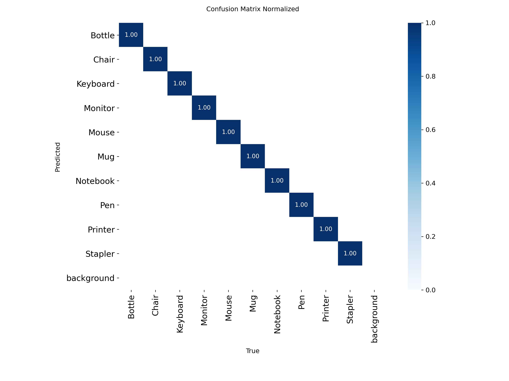
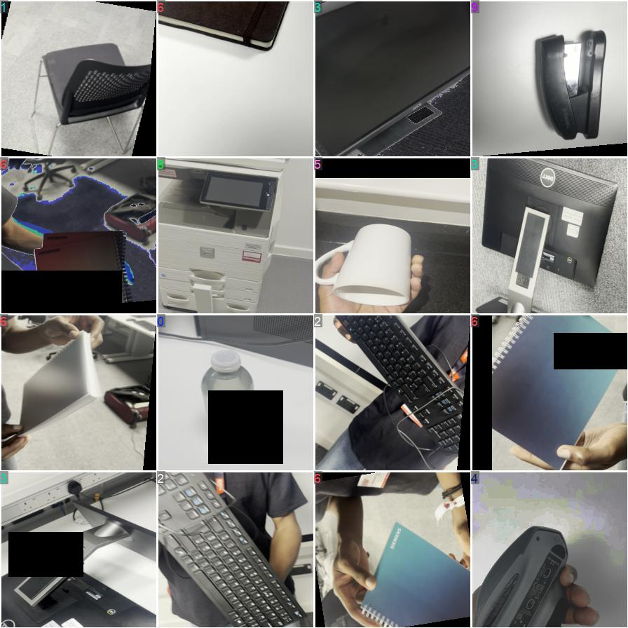
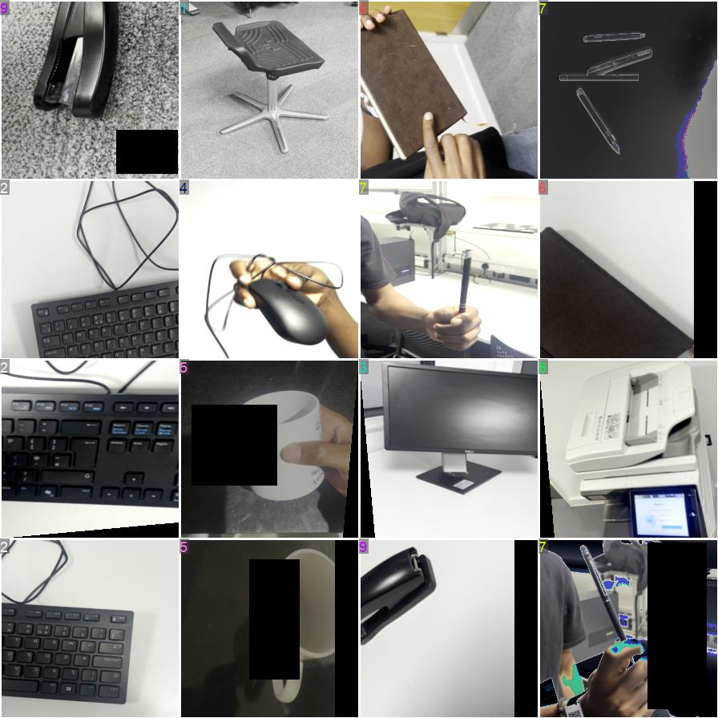
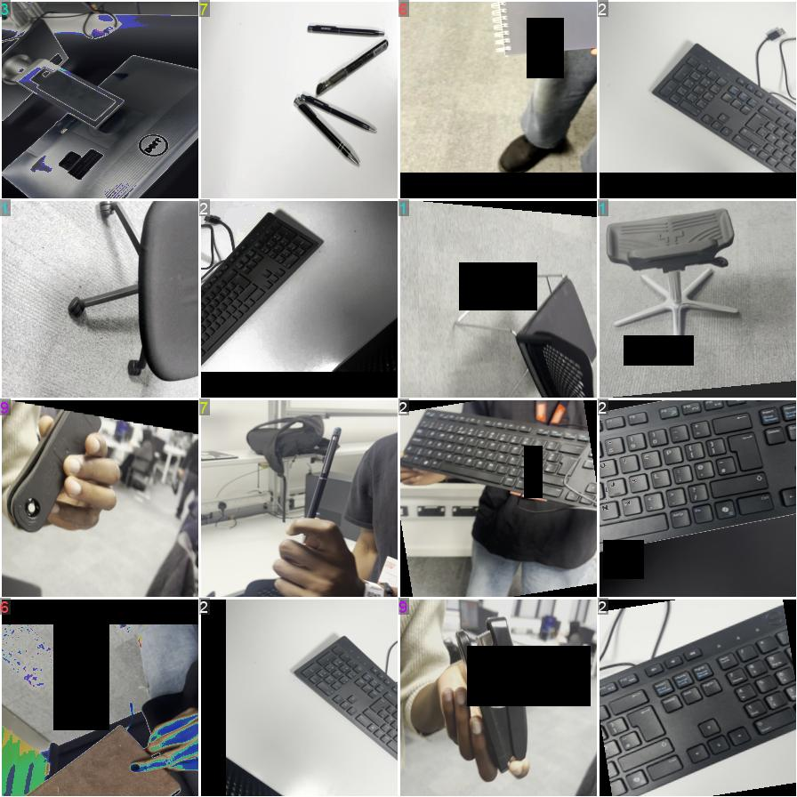
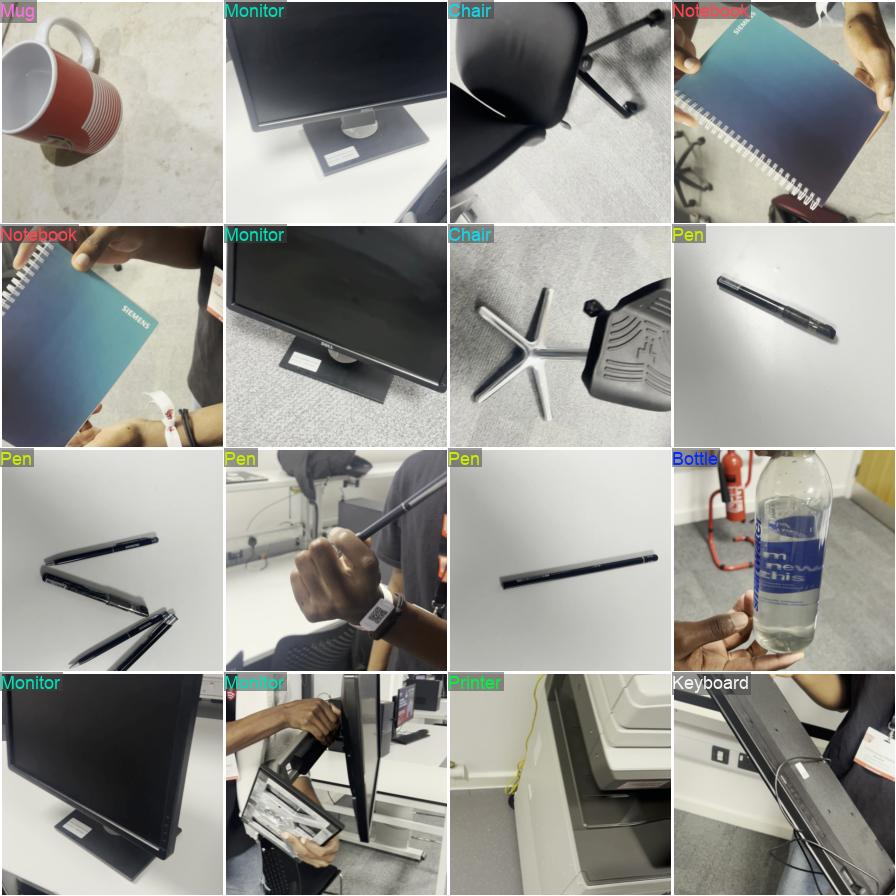
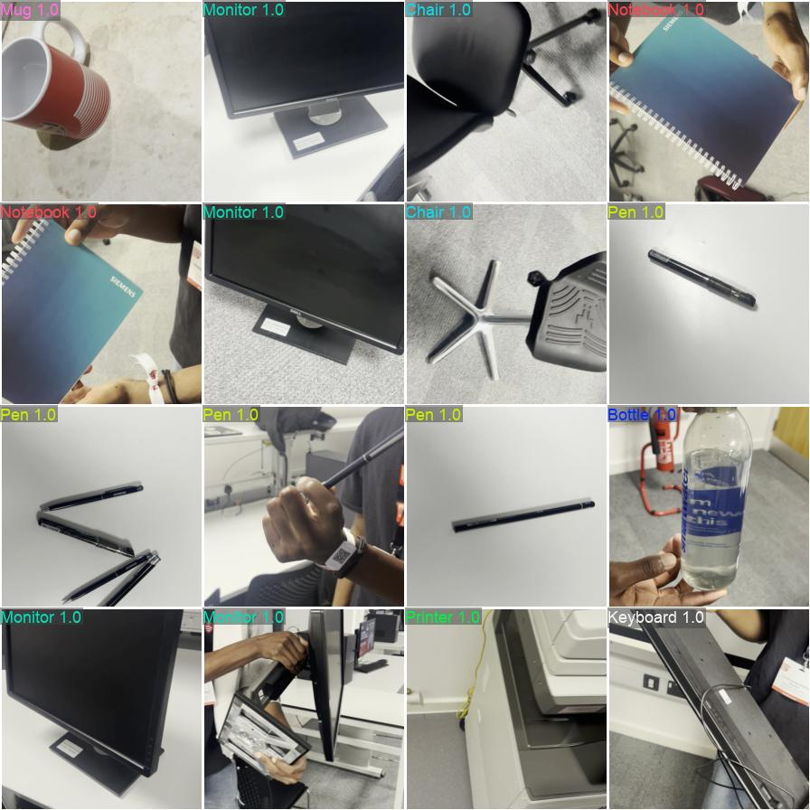
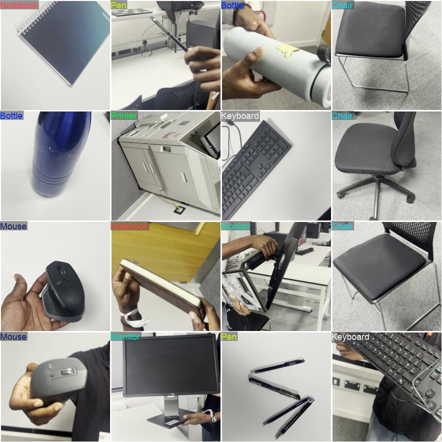
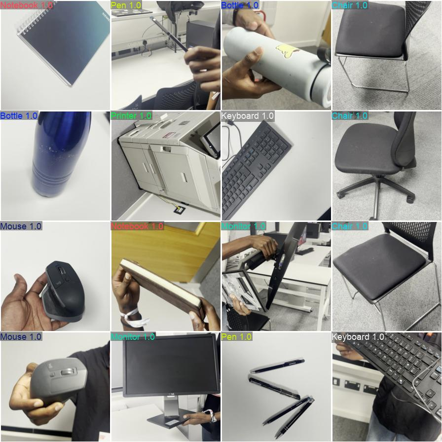
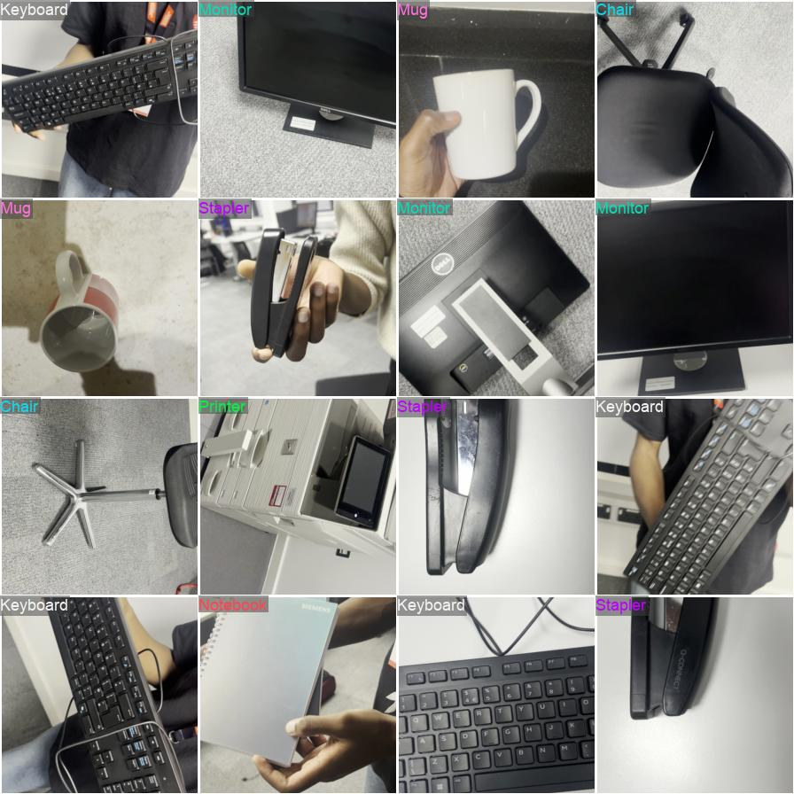
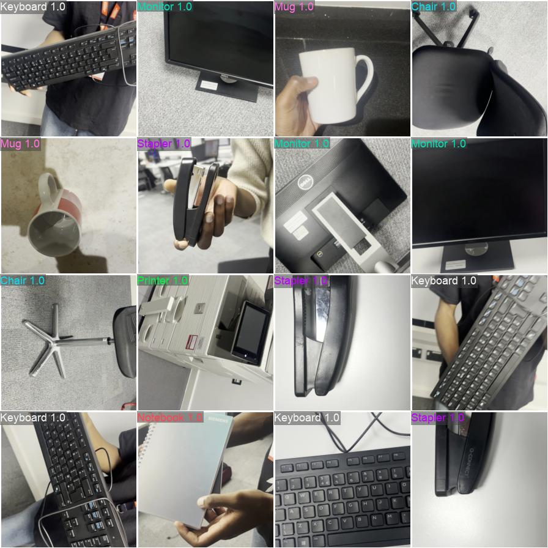

# YOLOv8n-cls V3 - Model Analysis

**Model:** YOLOv8n Classification  
**Version:** V3  
**Task:** 10-class office item classification  
**Training Date:** November 2025  
**Final Epoch:** ~12 (early stopping triggered)  
**Dataset Size:** ~1,950 validation samples

---

## Table of Contents

1. [Executive Summary](#executive-summary)
2. [Training Configuration](#training-configuration)
3. [Performance Metrics](#performance-metrics)
4. [Training Curves](#training-curves)
5. [Confusion Matrix Analysis](#confusion-matrix-analysis)
6. [Validation Predictions](#validation-predictions)
7. [Identified Issues](#identified-issues)
8. [Conclusions](#conclusions)

---

## Executive Summary

YOLOv8n-cls V3 achieved **near-perfect classification accuracy** on most classes but revealed a significant issue with the **Mouse class** (91% accuracy with 18 misclassifications). This analysis identified the need for dataset improvements that led to V4 development.

**Key Metrics:**
- ✅ Top-1 Accuracy: **~100%** on 9/10 classes
- ⚠️ Mouse class: **90.8% accuracy** (177/195 correct, 18 errors)
- ✅ Top-5 Accuracy: **100%** (perfect)
- ⚠️ Early stopping at Epoch ~12
- ✅ Rapid convergence (loss near 0 by epoch 5)

**Main Finding:** Model performance excellent except for systematic Mouse class confusion, indicating **dataset quality issue** rather than architecture problem.

**Action Taken:** Findings led to V4 development with expanded dataset (approximately 2× larger) and improved data quality.

---

## Training Configuration

### Model Architecture
```yaml
Model: yolov8n-cls.pt
Task: Image classification
Pretrained: Yes (ImageNet weights)
Parameters: ~2.7M (nano variant)
```

### Hyperparameters
```yaml
Epochs: 25 (stopped at ~12)
Batch Size: 32
Image Size: 224×224
Device: GPU (CUDA device '0')
Workers: 12
Optimizer: Auto (SGD)
Learning Rate: 0.01 → 0.01 (lr0 → lrf)
Weight Decay: 0.0005
Momentum: 0.937
Patience: 10 (early stopping)
```

### Dataset
```yaml
Training samples: ~1,560 per class
Validation samples: 195 per class (1,950 total)
Test samples: ~195 per class
Total classes: 10
```

---

## Performance Metrics

### Final Results

| Metric | Value |
|--------|-------|
| **Top-1 Accuracy** | **~100%** (9/10 classes) |
| **Top-5 Accuracy** | **100%** |
| **Mouse Accuracy** | **90.8%** (177/195) ⚠️ |
| **Training Loss** | **~0.02** (converged) |
| **Validation Loss** | **~0.001** (very low) |
| **Total Errors** | **18** (all from mouse class) |

### Key Observations

- **9 out of 10 classes achieved perfect 100% accuracy**
- Mouse class had 18 misclassifications (9.2% error rate)
- Top-5 accuracy perfect indicates correct class always in top 5 predictions
- Training converged rapidly (by epoch 5-6)
- Early stopping triggered around epoch 12

---

## Training Curves


### Loss Analysis

**Training Loss:**
- Started high (~0.8)
- Rapid drop in first epoch
- Converged to ~0.02 by epoch 6
- Remained stable through epoch 12
- **Pattern:** Smooth, monotonic decrease

**Validation Loss:**
- Started at ~0.012
- Dropped to ~0.001 by epoch 3
- Remained very low throughout
- **Pattern:** Rapid convergence, excellent generalization

### Accuracy Analysis

**Top-1 Accuracy:**
- Reached ~99-100% very quickly (by epoch 2-3)
- Minor fluctuations due to mouse class errors
- Stable around 99.9% after epoch 5

**Top-5 Accuracy:**
- **Perfect 100% throughout all epochs**
- Indicates strong feature learning
- Correct class always in top 5 predictions

---

## Confusion Matrix Analysis




### Class Performance Summary

| Class | Correct | Total | Errors | Accuracy |
|-------|---------|-------|--------|----------|
| Bottle | 195 | 195 | 0 | **100%** ✅ |
| Chair | 195 | 195 | 0 | **100%** ✅ |
| Keyboard | 195 | 195 | 0 | **100%** ✅ |
| Monitor | 195 | 195 | 0 | **100%** ✅ |
| **Mouse** | **177** | **195** | **18** | **90.8%** ⚠️ |
| Mug | 195 | 195 | 0 | **100%** ✅ |
| Notebook | 195 | 195 | 0 | **100%** ✅ |
| Pen | 195 | 195 | 0 | **100%** ✅ |
| Printer | 195* | 195 | 0* | **100%** ✅ |
| Stapler | 195* | 195 | 0* | **100%** ✅ |

*Note: Exact error counts for Printer and Stapler not visible in confusion matrix, but appear to have near-perfect performance*

### Key Findings

**Perfect Classes (9/10):**
- Bottle, Chair, Keyboard, Monitor, Mug, Notebook, Pen show perfect diagonal (1.00)
- Zero confusion with other classes
- Model learned distinctive features effectively

**Problem Class:**
- **Mouse: 177/195 correct (90.8% accuracy)**
- **18 misclassifications** - only source of errors
- Likely confused with similar small objects
- Indicates dataset limitation or class ambiguity

**Normalized Confusion Matrix:**
- Shows perfect 1.00 diagonal for all classes except Mouse
- Mouse shows 0.91 on diagonal
- Off-diagonal errors minimal but present for Mouse
- Background class detected but minimal presence

---

## Validation Predictions

### Training Batches





**Observations:**
- Good variety of objects and angles
- Clear visibility of objects
- Diverse backgrounds
- Proper lighting in most samples

### Validation Predictions










**Prediction Quality:**
- High confidence scores (close to 1.0) on most predictions
- Correct classifications visible in validation batches
- Clean probability distributions
- Mouse errors likely visible in mispredicted samples

---

## Identified Issues

### Primary Issue: Mouse Class Performance

**Problem:**
- 18 misclassifications out of 195 samples (9.2% error rate)
- Only class with significant errors
- Indicates systematic issue

**Possible Causes:**
1. **Dataset size/quality** - Insufficient mouse samples or variety
2. **Class similarity** - Visual confusion with other small objects (stapler, phone)
3. **Feature ambiguity** - Mouse features not distinctive enough
4. **Data imbalance** - Possible underrepresentation in training

**Impact:**
- Overall accuracy still excellent (~99.9%)
- But model not deployment-ready due to single-class failure
- Risk of systematic errors in real-world deployment

### Secondary Observations

**Training Dynamics:**
- Early stopping at epoch 12 may have been premature
- Model could potentially improve with more training
- Or dataset limitations prevent further improvement

**Dataset Size:**
- ~1,950 validation samples total
- May benefit from larger dataset
- Especially for problematic Mouse class

---

## Conclusions

### Summary of V3 Performance

**Strengths:**
- ✅ 9 out of 10 classes achieved perfect 100% accuracy
- ✅ Top-5 accuracy perfect (100%)
- ✅ Rapid convergence and stable training
- ✅ Excellent overall accuracy (~99.9%)
- ✅ Low validation loss indicating good generalization

**Weaknesses:**
- ⚠️ Mouse class: 90.8% accuracy (18 errors)
- ⚠️ Dataset size relatively small (~1,950 val samples)
- ⚠️ Early stopping may have been premature

### Key Takeaway

V3 demonstrated that **YOLOv8n architecture is well-suited for this task**, but revealed a **dataset limitation** with the Mouse class. The model's excellent performance on 9/10 classes indicates the architecture and training approach are sound.

**The main bottleneck is dataset size and quality**, not model capacity.

### Action Taken

Findings from V3 directly motivated V4 development with:
- **~2× larger dataset** (approximately double the training data)
- Enhanced data quality and variety
- Improved representation of problematic classes
- Better class balance

**Result:** V4 achieved 99.949% accuracy with only 1 total error (see V4 analysis).

---

**Author:** Oluwatunmise Shuaibu Raphael  
**Student ID:** M00960413  
**Module:** PDE3802 - AI in Robotics  
**Institution:** Middlesex University London  

*Analysis Date: November 7, 2025*  
*Model Version: V3*  
*Status: Superseded by V4*