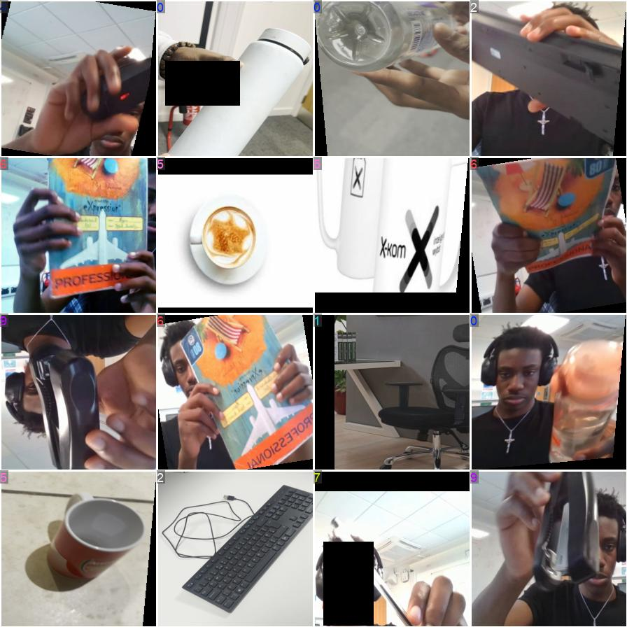
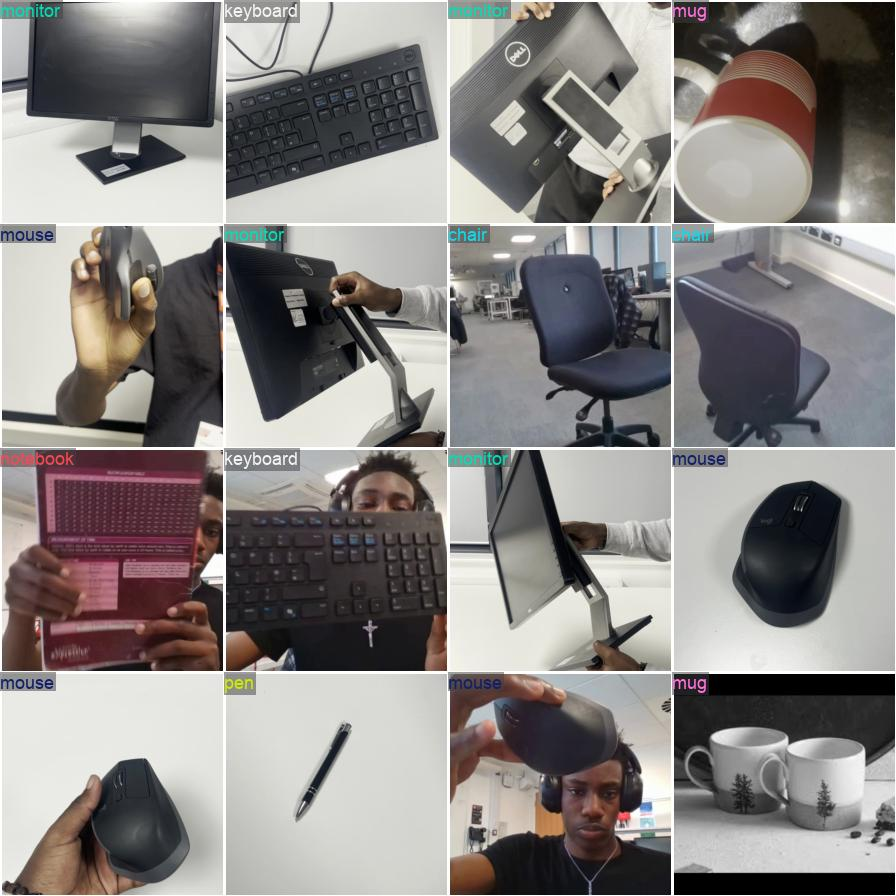

# YOLOv8n-cls V4 - Model Analysis

**Version:** V4 (Deployment Model)  
**Dataset:** ~3,900 samples (2× V3)  
**Status:** ✅ DEPLOYED  

---

## Executive Summary

V4 achieved **99.949% accuracy** with only **1 error** out of 1,961 validation samples.

**Key Improvement:** Dataset doubled from V3, fixing Mouse class (90.8% → 99.5%).

---

## Training Results

### Metrics (Epoch 18)
- Top-1 Accuracy: **99.949%**
- Top-5 Accuracy: **99.949%**
- Training Loss: **0.01459**
- Validation Loss: **0.00435**
- Training Time: **10.8 minutes**

---

## Confusion Matrix

### Per-Class Performance

| Class | Accuracy | Errors |
|-------|----------|--------|
| Bottle | 100% | 0 |
| Chair | 100% | 0 |
| Keyboard | 100% | 0 |
| Monitor | 100% | 0 |
| **Mouse** | **99.5%** | **1** ✅ Fixed! |
| Mug | 100% | 0 |
| Notebook | 100% | 0 |
| Pen | 100% | 0 |
| Printer | 100% | 0 |
| Stapler | 100% | 0 |

**9/10 classes perfect, Mouse 99.5% (vs 90.8% in V3)**

---

## Validation Predictions

**High confidence predictions, clean probability distributions.**

---

## Conclusions

**Success Factor:** Doubling dataset size from V3 to V4.

**Results:**
- 96% error reduction (18 → 1)
- All classes ≥99.5%
- Deployment-ready
- Deployed in UI

---

*Author: Oluwatunmise Shuaibu Raphael*  
*M00960413 | PDE3802 | Middlesex University*