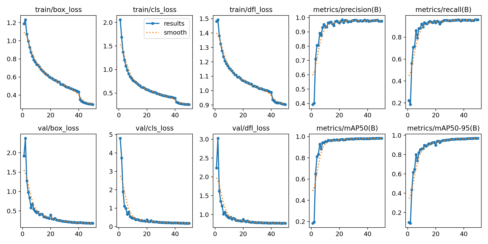
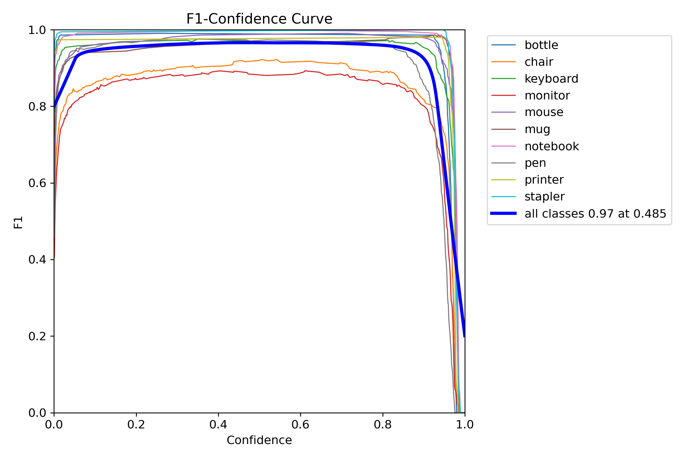
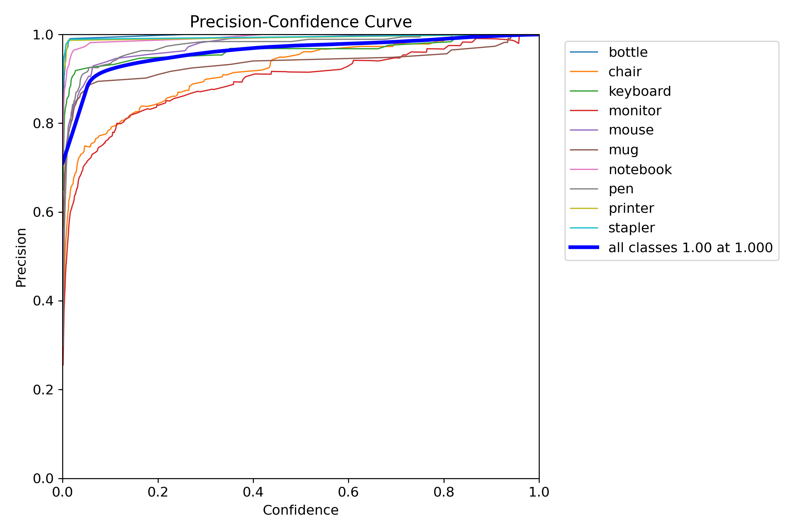
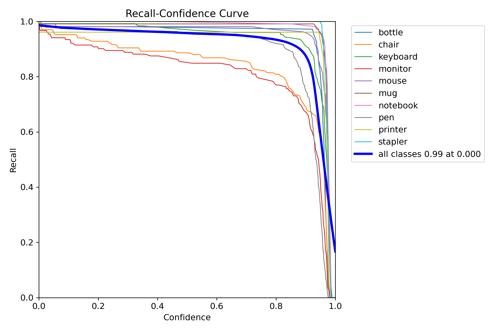
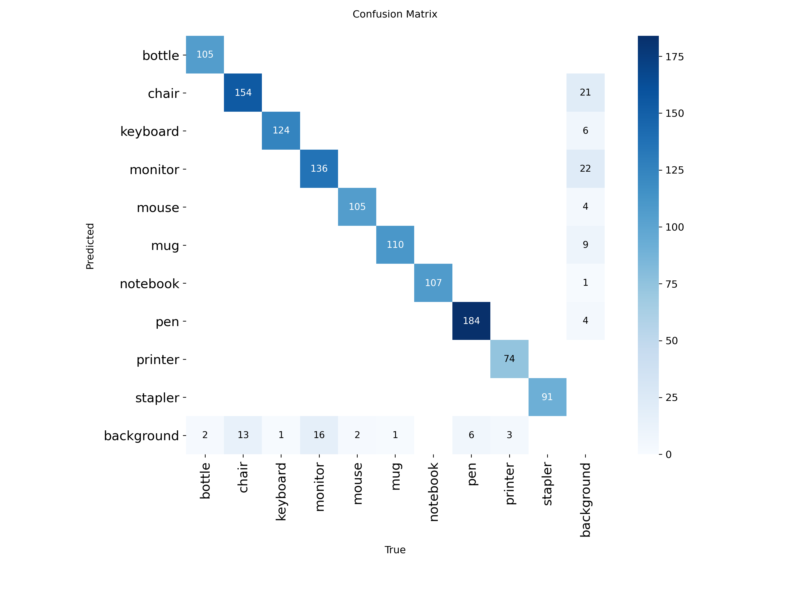
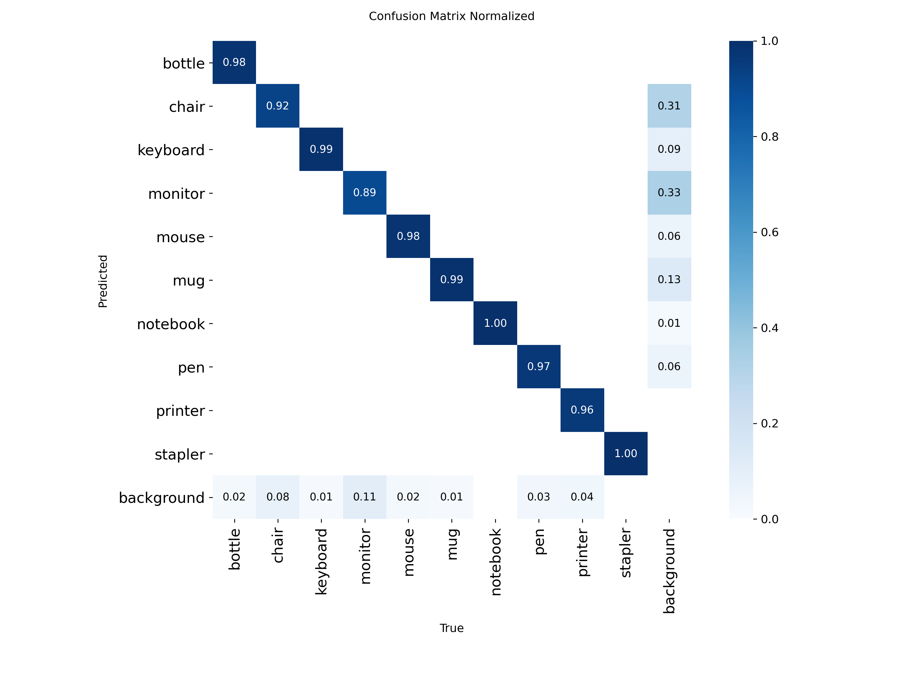

# YOLOv8n Detection V1 - Model Analysis

**Version:** V1 (Baseline)  
**Dataset:** ~13,000 instances  
**Status:** Baseline model  

---

## Executive Summary

V1 achieved **98.4% mAP@0.5** with significant background confusion issues. Monitor and Chair classes showed moderate performance problems.

**Key Metrics:**
- mAP@0.5: **98.4%**
- mAP@0.5-0.95: **~98%**
- Training: 50 epochs (early stopped)
- Background FPs: **44**

---

## Training Configuration

```yaml
Epochs: 50 (stopped early)
Batch: 32
Image Size: 640×640
Patience: 15
Optimizer: AdamW
Learning Rate: 0.01
Device: GPU
```

---

## Performance Metrics



### Per-Class AP (from PR curve)

| Class | AP@0.5 | Status |
|-------|--------|--------|
| Bottle | 0.994 | ✅ Excellent |
| Chair | 0.966 | ⚠️ Moderate |
| Keyboard | 0.993 | ✅ Excellent |
| Monitor | 0.944 | ⚠️ Worst |
| Mouse | 0.994 | ✅ Excellent |
| Mug | 0.995 | ✅ Excellent |
| Notebook | 0.995 | ✅ Excellent |
| Pen | 0.985 | ✅ Excellent |
| Printer | 0.979 | ✅ Good |
| Stapler | 0.995 | ✅ Excellent |
| **All Classes** | **0.984** | ✅ Good |

---

## Curves






---

## Confusion Matrix




### Issues Identified

**1. Chair - 92% normalized accuracy**
- 21 background FPs
- Confusion with background

**2. Monitor - 89% normalized accuracy**
- 22 background FPs  
- Worst performing class
- Rectangular shape confusion

**3. Background Predictions: 44 total**
- 13 chair FPs
- 16 monitor FPs
- 15 other class FPs

---

## Dataset Distribution


**Instance counts (~1,119-1,670 per class):**
- Chair: 1,666
- Monitor: 1,670
- Pen: 1,624
- Total: ~13,000 instances

---

## Conclusions

**Strengths:**
- High overall mAP (98.4%)
- Most classes >99% AP

**Weaknesses:**
- Monitor class struggles (94.4%)
- Chair background confusion
- 44 background false positives

**Recommendation:** Increase dataset size and improve monitor/chair representation.

---

*M00960413 | PDE3802 | Middlesex University*