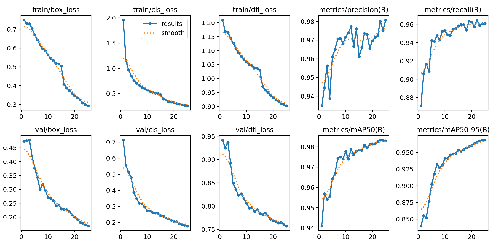
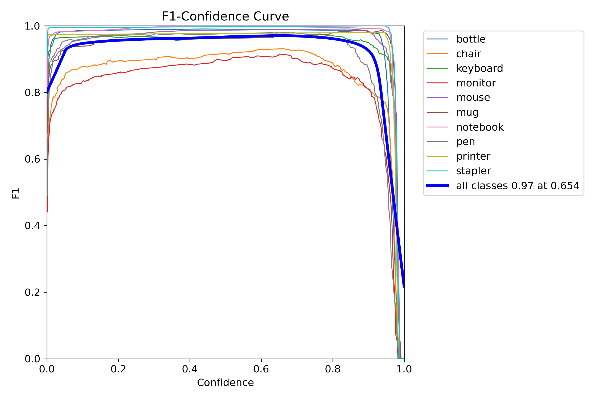
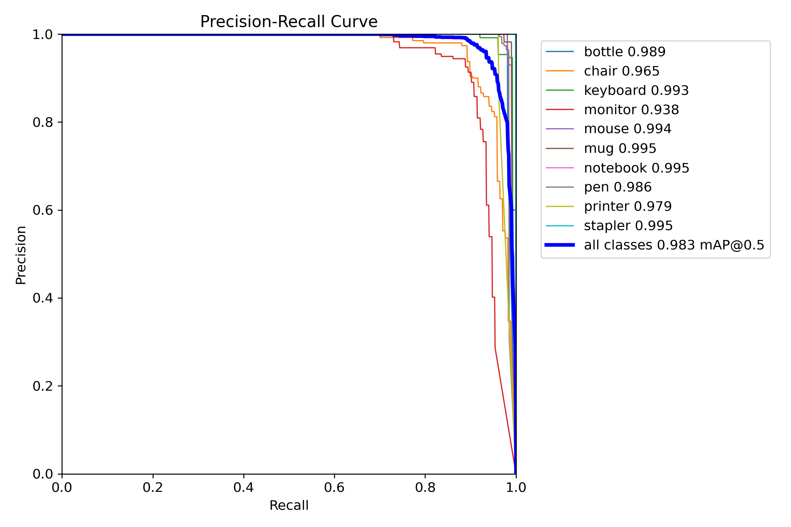
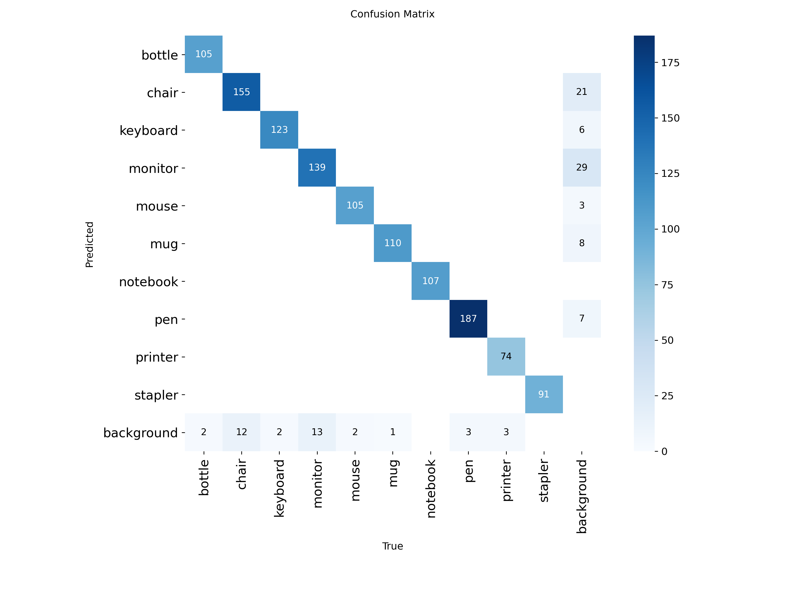
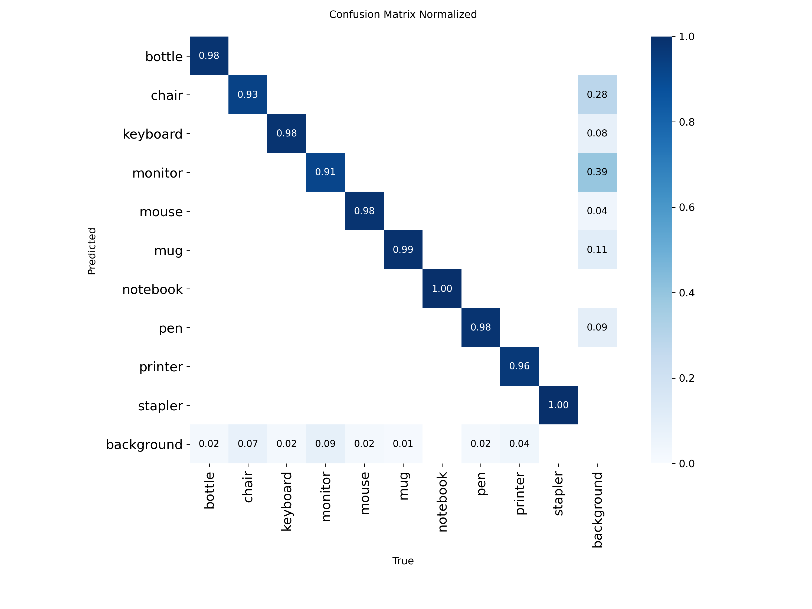

# YOLOv8n Detection V2 - Model Analysis

**Version:** V2  
**Dataset:** ~13,000 instances  
**Status:** Improved over V1  

## Executive Summary

V2 achieved **98.3% mAP@0.5** with improved training stability (batch 16, patience 100).

**Key Metrics:**
- mAP@0.5: **98.3%**
- mAP@0.5-0.95: **~96%**
- Training: 25 epochs
- Background FPs: **38** (improved from V1!)

## Training Configuration

```yaml
Epochs: 25
Batch: 16 (vs V1: 32)
Patience: 100 (vs V1: 15)
Optimizer: auto (vs V1: AdamW)
```

## Performance Metrics



### Per-Class AP

| Class | AP@0.5 | vs V1 |
|-------|--------|-------|
| Bottle | 0.989 | -0.5% |
| Chair | 0.965 | -0.1% |
| Keyboard | 0.993 | Same |
| Monitor | 0.938 | -0.6% |
| Mouse | 0.994 | Same |
| Mug | 0.995 | Same |
| Notebook | 0.995 | Same |
| Pen | 0.986 | +0.1% |
| Printer | 0.979 | Same |
| Stapler | 0.995 | Same |
| **All Classes** | **0.983** | **-0.1%** |

## Curves




## Confusion Matrix




### Improvements

- Chair: 155 correct (vs V1: 154)
- Monitor: 139 correct (vs V1: 136)
- Background FPs: 38 (vs V1: 44) **-14%**

## Conclusions

**V2 = Best among V1/V2/V3** due to reduced background confusion despite similar mAP.

---

*M00960413 | PDE3802 | Middlesex University*