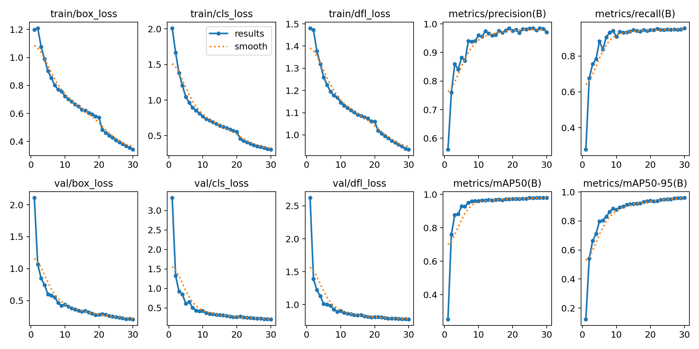
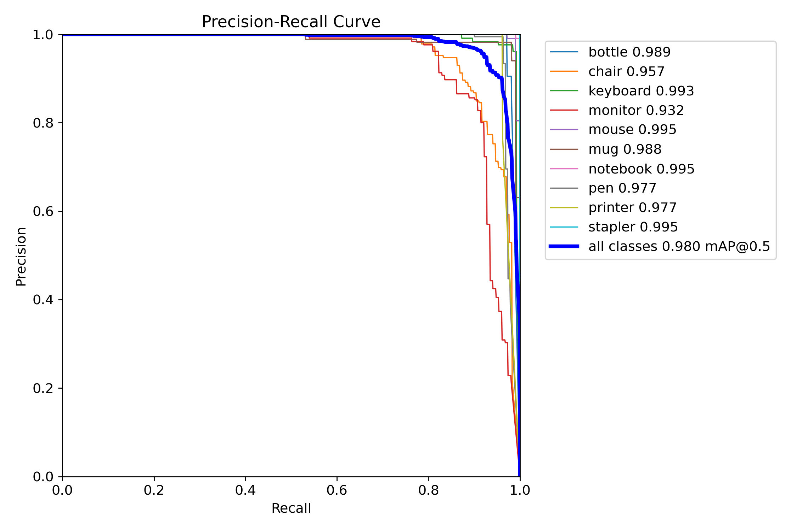
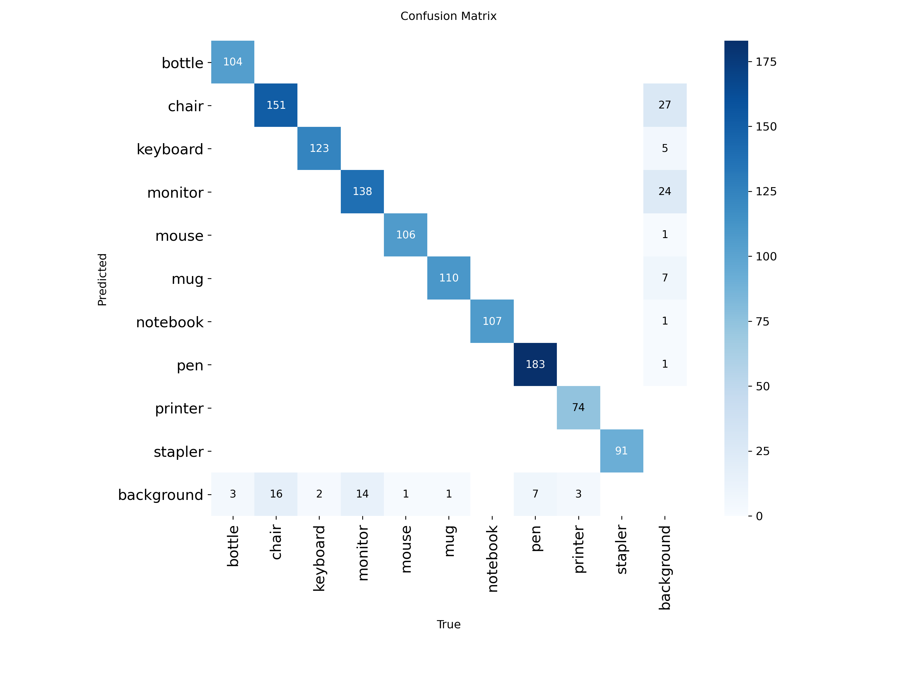

# YOLOv8n Detection V3 - Model Analysis

**Version:** V3  
**Dataset:** ~13,000 instances  
**Status:** Overfitted  

## Executive Summary

V3 achieved **98.0% mAP@0.5** with enhanced augmentation but worse background confusion.

**Key Metrics:**
- mAP@0.5: **98.0%**
- mAP@0.5-0.95: **~99%**
- Training: 30 epochs
- Background FPs: **47** (worst among V1/V2/V3)

## Training Configuration

```yaml
Epochs: 30 (longest)
Batch: 16
Patience: 20
Optimizer: AdamW
lr0: 0.008 (lower than V1/V2)
Enhanced augmentation: hsv_h=0.02, translate=0.15, scale=0.55
```

## Performance vs V2

| Metric | V2 | V3 | Change |
|--------|----|----|--------|
| mAP@0.5 | 98.3% | 98.0% | **-0.3%** |
| Monitor AP | 0.938 | 0.932 | -0.6% |
| Chair AP | 0.965 | 0.957 | -0.8% |
| Background FPs | 38 | 47 | **+24%** worse |

## Curves




## Confusion Matrix



## Conclusions

**V3 overfitted** with too many epochs (30) and aggressive augmentation. Worse than V2.

---

*M00960413 | PDE3802 | Middlesex University*