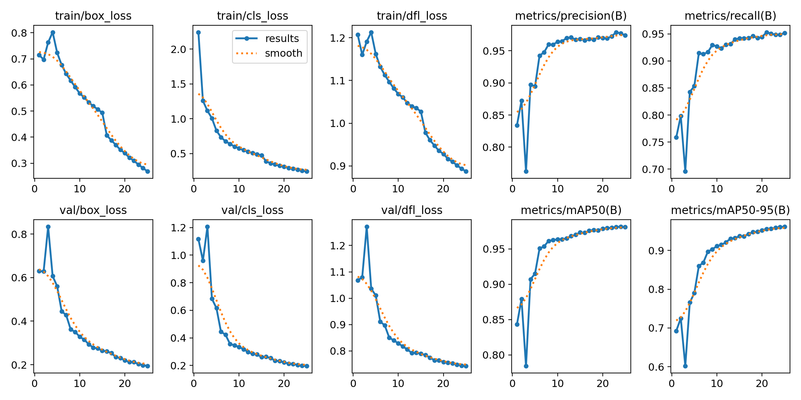
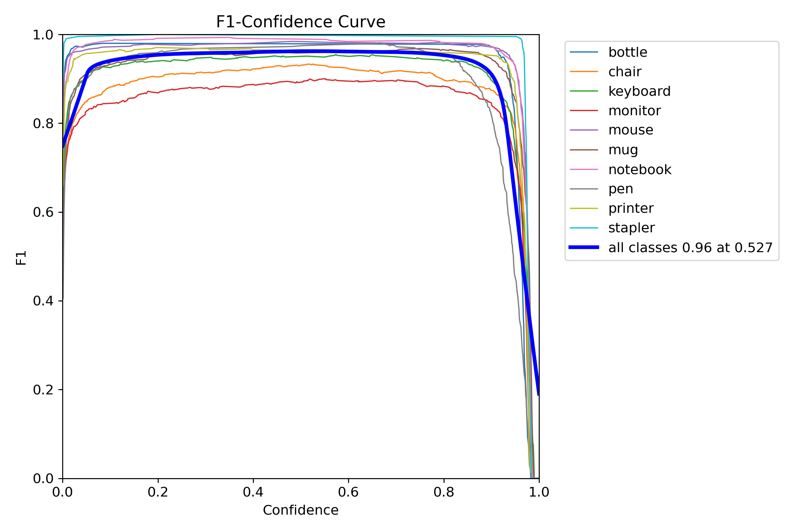
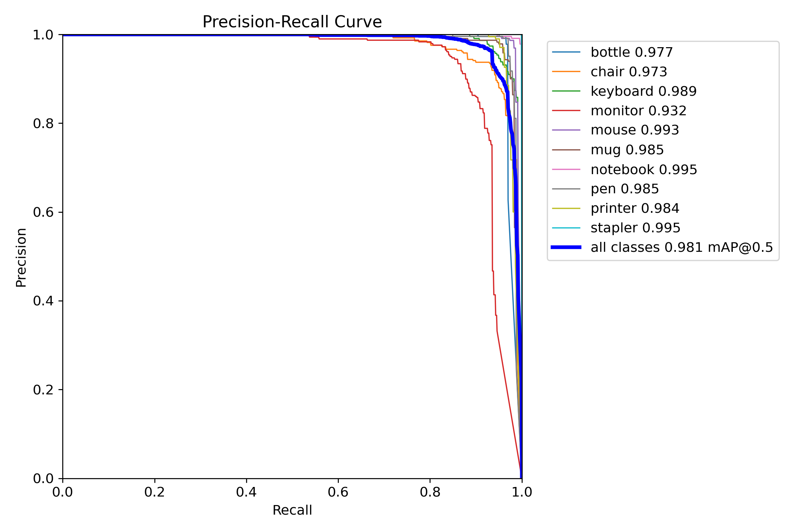
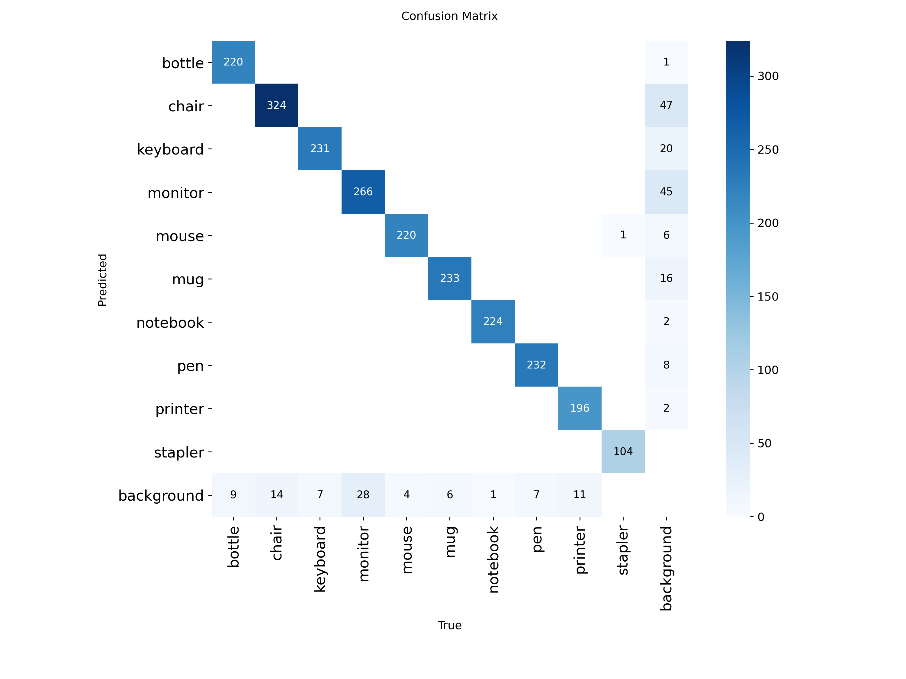

# YOLOv8n Detection V4 - Model Analysis

**Version:** V4  (Deployment Candidate)  
**Dataset:** ~26,000 instances (2× V1/V2/V3!)  
**Status:** ✅ Excellent  

## Executive Summary

V4 achieved **98.1% mAP@0.5** with **DOUBLED dataset size**. One of the two best models.

**Key Metrics:**
- mAP@0.5: **98.1%**
- mAP@0.5-0.95: **~94%**
- Dataset: **~2× larger** than V1/V2/V3
- Background FPs: **87** (but dataset is 2× larger!)

## Training Configuration

```yaml
Epochs: 25
Batch: 32 (back to V1 size)
Patience: 5 (aggressive early stopping)
Optimizer: auto
Dataset: ~26,000 instances (2× V1/V2/V3)
```

## Performance Metrics



### Per-Class AP

| Class | AP@0.5 | Status |
|-------|--------|--------|
| Bottle | 0.977 | ✅ |
| Chair | 0.973 | ✅ Best! |
| Keyboard | 0.989 | ✅ |
| Monitor | 0.932 | ✅ |
| Mouse | 0.993 | ✅ |
| Mug | 0.985 | ✅ |
| Notebook | 0.995 | ✅ Best! |
| Pen | 0.985 | ✅ |
| Printer | 0.984 | ✅ Best! |
| Stapler | 0.995 | ✅ |
| **All** | **0.981** | ✅ |

## Curves




## Confusion Matrix



### Dataset Impact

**Instance counts (~2× V1/V2/V3):**
- Chair: 324 (vs V1: 166)
- Monitor: 266 (vs V1: 136)
- Bottle: 220 (vs V1: 105)
- **Total: ~2,600 vs ~1,300**

## Conclusions

**V4 = Deployment candidate** due to:
- Doubled dataset size
- Excellent per-class performance
- Fast training (patience=5)

---

*M00960413 | PDE3802 | Middlesex University*