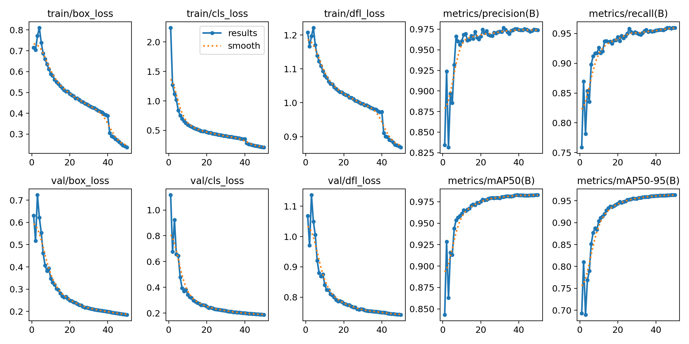
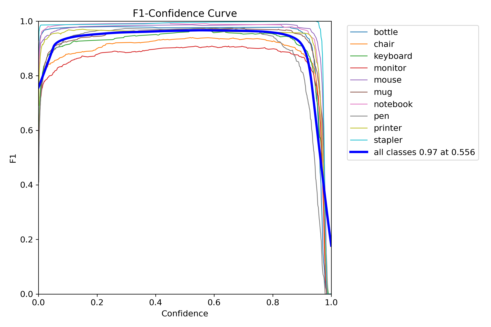
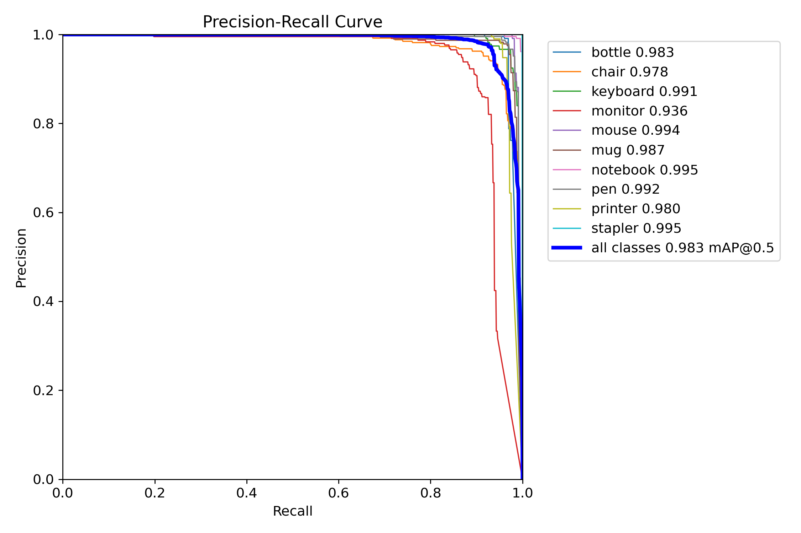

# YOLOv8n Detection V5 - Model Analysis

**Version:** V5  (Deployment Model)  
**Dataset:** ~26,000 instances (same as V4)  
**Status:** ✅ **BEST MODEL**  

## Executive Summary

V5 achieved **98.3% mAP@0.5**, the **HIGHEST** among all versions. Longer training (50 epochs) vs V4.

**Key Metrics:**
- mAP@0.5: **98.3%** ← **BEST!**
- mAP@0.5-0.95: **~96%** ← **BEST!**
- Background FPs: **75** (vs V4: 87)
- Training: 50 epochs (most patient)

## Training Configuration

```yaml
Epochs: 50 (vs V4: 25)
Batch: 32
Patience: 10 (vs V4: 5)
Optimizer: auto
Dataset: ~26,000 instances (same as V4)
```

## Performance Metrics



### Per-Class AP

| Class | V5 AP | V4 AP | Improvement |
|-------|-------|-------|-------------|
| Bottle | 0.983 | 0.977 | **+0.6%** ✅ |
| Chair | 0.978 | 0.973 | **+0.5%** ✅ |
| Keyboard | 0.991 | 0.989 | **+0.2%** ✅ |
| Monitor | 0.936 | 0.932 | **+0.4%** ✅ |
| Mouse | 0.994 | 0.993 | **+0.1%** ✅ |
| Mug | 0.987 | 0.985 | **+0.2%** ✅ |
| Notebook | 0.995 | 0.995 | Same |
| Pen | 0.992 | 0.985 | **+0.7%** ✅ |
| Printer | 0.980 | 0.984 | -0.4% |
| Stapler | 0.995 | 0.995 | Same |
| **All** | **0.983** | **0.981** | **+0.2%** ✅ |

## Curves




## Confusion Matrix


### V5 Improvements over V4

- **Background FPs: 75 vs 87** (-14%)
- **Monitor detections: 272 vs 266** (+6)
- **Better overall mAP: 98.3% vs 98.1%**

## Conclusions

**V5 = BEST MODEL** due to:
- Highest mAP (98.3%)
- Fewer background FPs
- Better per-class performance
- Longer, more patient training

**Recommendation:** Deploy V5 in Deployment.

---

*M00960413 | PDE3802 | Middlesex University*