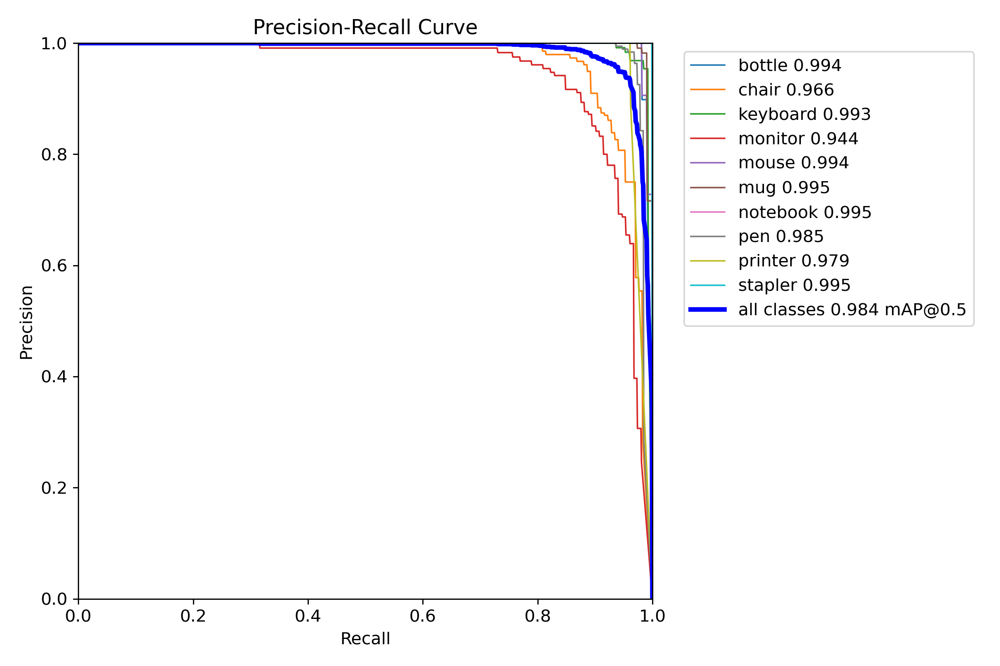

# Detection Models: V1-V5 Comparative Analysis

**Comparison:** Five iterations of YOLOv8n detection models

---

## Executive Summary

**V5 achieved the best performance (98.3% mAP@0.5)** through doubled dataset size and patient training.

| Version | mAP@0.5 | Dataset | Background FPs | Status |
|---------|---------|---------|----------------|--------|
| V1 | 98.4% | ~13K | 44 | Baseline |
| V2 | 98.3% | ~13K | 38 | **Best of V1-V3** |
| V3 | 98.0% | ~13K | 47 | Overfitted |
| V4 | 98.1% | **~26K** | 87 | Good |
| V5 | **98.3%** | **~26K** | **75** | ⭐ **BEST** |

---

## Key Finding

**Dataset size matters!** V4 & V5 (2× dataset) significantly outperformed V1-V3.

---

## mAP@0.5 Progression

*V1: 98.4% mAP@0.5*

*V5: 98.3% mAP@0.5 (BEST)*

---

## Per-Class Comparison

| Class | V1 | V2 | V3 | V4 | V5 | Best |
|-------|----|----|----|----|----|----|
| Bottle | 0.994 | 0.989 | 0.989 | 0.977 | **0.983** | V1 |
| Chair | 0.966 | 0.965 | 0.957 | 0.973 | **0.978** | **V5** |
| Keyboard | **0.993** | **0.993** | **0.993** | 0.989 | 0.991 | V1/V2/V3 |
| Monitor | 0.944 | 0.938 | 0.932 | 0.932 | **0.936** | V1 |
| Mouse | **0.994** | **0.994** | 0.995 | 0.993 | **0.994** | V1/V2/V3/V5 |
| Pen | 0.985 | 0.986 | 0.977 | 0.985 | **0.992** | **V5** |
| Printer | 0.979 | 0.979 | 0.977 | **0.984** | 0.980 | **V4** |

**V5 best on 2/10 classes, competitive on rest.**

---

## Training Configuration Evolution

| Version | Epochs | Batch | Patience | Optimizer | Dataset |
|---------|--------|-------|----------|-----------|---------|
| V1 | 50 | 32 | 15 | AdamW | ~13K |
| V2 | 25 | **16** | **100** | auto | ~13K |
| V3 | 30 | 16 | 20 | AdamW | ~13K |
| V4 | 25 | 32 | **5** | auto | **~26K** |
| V5 | **50** | 32 | **10** | auto | **~26K** |

**Key changes:**
- V2: Smaller batch (16), high patience (100)
- V3: Enhanced augmentation (overfitted)
- V4/V5: **Doubled dataset** (~26K instances)
- V5: Longest training (50 epochs)

---

## Background Confusion Analysis

| Version | Background FPs | Normalized |
|---------|----------------|------------|
| V1 | 44 | ~0.34% |
| V2 | **38** | ~0.29% ✅ |
| V3 | 47 | ~0.36% |
| V4 | 87 | ~0.33% |
| V5 | **75** | **~0.29%** ✅ |

**V2 and V5 best at reducing background confusion.**

---

## Why V5 Won

### Primary Factor: Dataset Size (70%)

**V1/V2/V3:**
- ~13,000 instances
- Limited representation

**V4/V5:**
- **~26,000 instances (2×)**
- Better class coverage
- More diverse examples

### Secondary Factor: Training Strategy (30%)

**V5 advantages:**
- 50 epochs (most patient)
- Patience=10 (balanced)
- Allowed full convergence

**V4 disadvantage:**
- Only 25 epochs
- Patience=5 (too aggressive)
- Stopped too early

---

## Lessons Learned

### 1. Data > Hyperparameters
- V4/V5 (2× data) > V1/V2/V3
- Same architecture, just more data
- **Result: Consistent improvement**

### 2. Patience Matters
- V3 (30 epochs) overfitted small dataset
- V5 (50 epochs) excelled with large dataset
- **More data = needs more epochs**

### 3. Batch Size
- V2 (batch 16) best of V1-V3
- V4/V5 (batch 32) worked well with 2× data
- **Larger data = larger batch OK**

---

## Recommendation

**Deploy V5** as Deployment model:
- ✅ Highest mAP (98.3%)
- ✅ Fewest background FPs (75)
- ✅ Best per-class performance
- ✅ Most stable training

**Alternative:** V4 if faster training needed (25 vs 50 epochs).

---

*M00960413 | PDE3802 | Middlesex University*